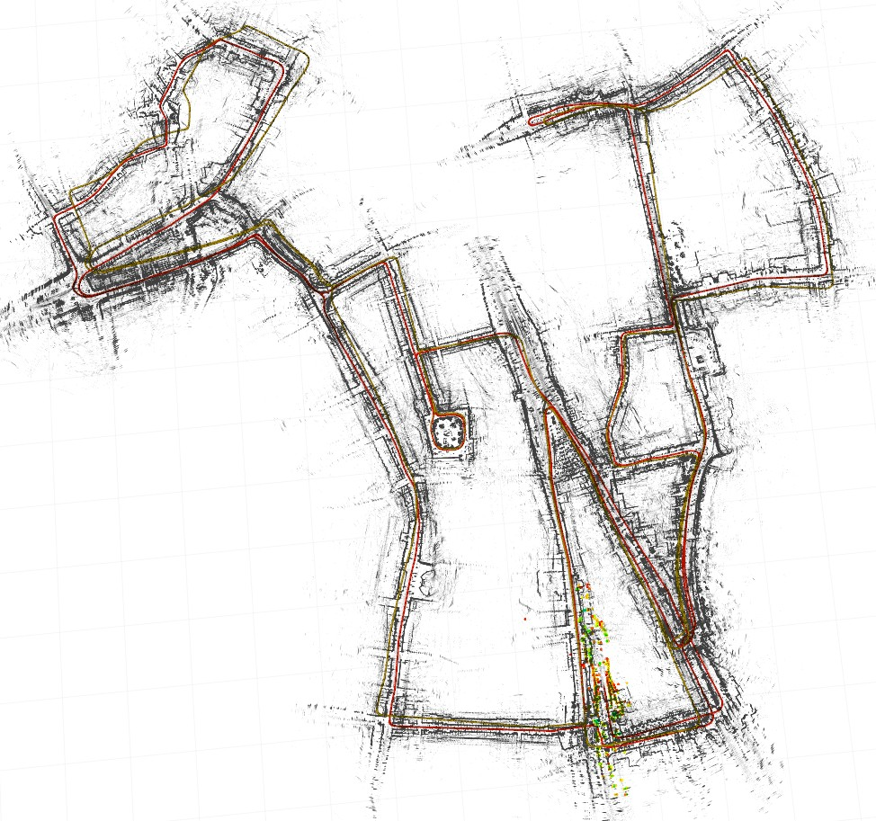

# CFEAR Radarodometry
This guide describes how to download data and estimate radar odometry using CFEAR_Radarodometry

  
## Prerequisites
  * Install the Google Ceres solver  http://ceres-solver.org/installation.html
  * ROS [Melodic](http://wiki.ros.org/melodic) or later, tested with ubuntu 16.04, 18.04 and 20.04

## How to build with catkin

```
$ cd ~/catkin_ws/src/
$ git clone https://github.com/dan11003/CFEAR_Radarodometry_code_public.git
$ cd ~/catkin_ws
$ catkin_make -DCMAKE_BUILD_TYPE=Release 
$ source ~/catkin_ws/devel/setup.bash
```
## Downloading data (Oxford Radar RobotCar)
Currently, only rosbags that contain sensor_msgs/Image are supported.
We prepared a rosbag from the Oxford Radar Robotcar dataset on our [google drive](https://drive.google.com/drive/folders/12YNIvHQqSO5Et3UIzKD1z3XQACpoGZ1L?usp=sharing)
Download the Oxford bag file from (processed rosbag)/2019-01-10-12-32-52-radar-oxford-10k.bag to the folder created below:
```
mkdir -p /home/${USER}/Documents/oxford-eval-sequences/2019-01-10-12-32-52-radar-oxford-10k/
cd /home/${USER}/Documents/oxford-eval-sequences/2019-01-10-12-32-52-radar-oxford-10k/
```

## Running
The odometry can be launched in two modes.
* Offline: (used in this guide) runs at the maximum possible rate.
* Online: Standard rostopic interface. radar_driver_node and odometry_keyframes. The radar_driver_node subscribes to "/Navtech/Polar" 

```
roscd cfear_radarodometry/launch
./oxford_demo
```

## Optional -  Evaluate odometry quality

```
cd ~/catkin_ws/src/
git clone https://github.com/dan11003/radar_kitti_benchmark 
cd radar_kitti_benchmark/python
./oxford_demo_eval.sh
```

This will compute odometry error metrics and draw graphs and figures and save these to the folder:
```
/home/${USER}/Documents/oxford-eval-sequences/2019-01-10-12-32-52-radar-oxford-10k/eval/<yyyy-mm-dd_HH:mm>,`
```
where the folder name <yyyy-mm-dd_HH:mm>  is set automatically according to time.

Some of the evaluation output is:
 * The raw trajectory (/est/01.txt)
 * Trajectory visualized (/est/plot_path/sequence_01_orig.pdf)  -  similar to Fig.15a in the article
 * Error metrics (/est/result.txt). -  Tab.III (row "CFEAR-3", column "10-12-32") in the article.
 * Parameters  (pars.txt)  - Tab.I (column "CFEAR-3")  in the article
 
 
NOTE: Results are slightly better compared to the article.


## Troubleshooting

If the fixes below does not help. Ask questions [here](https://github.com/dan11003/CFEAR_Radarodometry/issues).

### Malformed bagfile
```console
# Problem
user@computer:~$ terminate called after throwing an instance of 'rosbag::BagFormatException' what():  Required 'op' field missing
# Solution
rosbag reindex 2019-01-10-12-32-52-radar-oxford-10k.bag
```
### Compilation issue due to incompatible versions of LZ4 in ROS Melodic
During compilation, this error can occur on some installations of Ubuntu 18.04 with ROS Melodic:
```console
/usr/include/flann/ext/lz4.h:196:57: error: conflicting declaration ‘typedef struct LZ4_stream_t LZ4_stream_t’
 typedef struct { long long table[LZ4_STREAMSIZE_U64]; } LZ4_stream_t;
...
/usr/include/lz4.h:196:57: note: previous declaration as ‘typedef struct LZ4_stream_t LZ4_stream_t’
 typedef struct { long long table[LZ4_STREAMSIZE_U64]; } LZ4_stream_t;
```
and
```console
/usr/include/flann/ext/lz4.h:249:72: error: conflicting declaration ‘typedef struct LZ4_streamDecode_t LZ4_streamDecode_t’
 typedef struct { unsigned long long table[LZ4_STREAMDECODESIZE_U64]; } LZ4_streamDecode_t;
...
/usr/include/lz4.h:249:72: note: previous declaration as ‘typedef struct LZ4_streamDecode_t LZ4_streamDecode_t’
 typedef struct { unsigned long long table[LZ4_STREAMDECODESIZE_U64]; } LZ4_streamDecode_t;
```
This error is caused by two conflicting versions of LZ4, one used for ROS serialization and the other one by flann kdtree in PCL. As this [GitHub issue](https://github.com/ethz-asl/lidar_align/issues/16) suggests, there are a few ways to fix it, yet none of them can be really considered clean. We suggest using simlinks to point to a single version of the conficting header files, since this modification can be easily reverted:
```console
sudo mv /usr/include/flann/ext/lz4.h /usr/include/flann/ext/lz4.h.bak
sudo mv /usr/include/flann/ext/lz4hc.h /usr/include/flann/ext/lz4.h.bak


sudo ln -s /usr/include/lz4.h /usr/include/flann/ext/lz4.h
sudo ln -s /usr/include/lz4hc.h /usr/include/flann/ext/lz4hc.h
```
## Future

* Prepare demo for MulRan, VolvoCE, Kvarntorp and Orkla.

## Developing

Feel free to issue pull requests with updates.


## Other files
For a detailed guide on how to download and format Oxford RobotCar radar data into rosbags, visit our [Oxford converter readme file](https://docs.google.com/document/d/1ij8E4PMpCpBwWYbRAdU9rnScocOaMB4Sqz4XS48XWoo/edit?usp=sharing).
Data from the MulRan dataset can be processed using the [file_player_tool](https://github.com/irapkaist/file_player_mulran).
Don't forget to specify the sensor resolution and the dataset parameter if you use something other than Oxford data.

## Updates
Follow our updates [here](https://github.com/dan11003/CFEAR_Radarodometry).

This repository is based on the conference paper presented at [IROS 2021](https://ieeexplore.ieee.org/document/9636253). Journal is currently under review.
<details>
<summary>Bibtex</summary>
 
```
@INPROCEEDINGS{9636253,  author={Adolfsson, Daniel and Magnusson, Martin and Alhashimi, Anas and Lilienthal, Achim J. and Andreasson, Henrik},
booktitle={2021 IEEE/RSJ International Conference on Intelligent Robots and Systems (IROS)},
title={CFEAR Radarodometry - Conservative Filtering for Efficient and Accurate Radar Odometry},
year={2021},  volume={},  number={},  pages={5462-5469},
doi={10.1109/IROS51168.2021.9636253}}
  
```
</details>  


